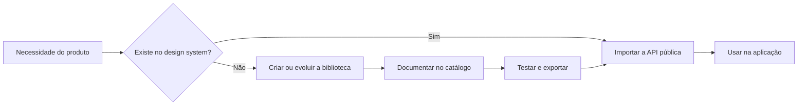

<div align="center">

# Content Ventures Design System

**A camada visual compartilhada de todos os produtos da Content Ventures.**

Componentes React, tokens, padrões de interação e um catálogo vivo para construir interfaces
consistentes sem reinventar a base visual em cada projeto.

`Next.js 16` · `React 19` · `TypeScript` · `CSS Modules`

</div>

---

## Sobre o projeto

Este repositório reúne duas partes que evoluem como um único produto:

| Camada         | Responsabilidade                                                | Fonte principal                                        |
| -------------- | --------------------------------------------------------------- | ------------------------------------------------------ |
| **Biblioteca** | Componentes, tokens, fontes, ícones e padrões reutilizáveis     | [`src/components/ds-v3`](src/components/ds-v3)         |
| **Catálogo**   | Documentação visual, exemplos reais e validação dos componentes | [`src/app/design-system-v3`](src/app/design-system-v3) |

> [!IMPORTANT]
> Nenhuma aplicação da Content Ventures deve criar um componente visual do zero antes de procurar a
> solução no design system. Se ela não existir, deve ser criada e validada aqui primeiro.



Essa regra vale para pessoas e para qualquer agente de código usado pela empresa, incluindo Codex,
Claude e outras ferramentas.

## O que está incluído

- fundamentos visuais, temas e tokens semânticos;
- botões, formulários, navegação e estrutura de páginas;
- tabelas, listas, filtros e visualização de dados;
- feedback, estados vazios, erros e carregamento;
- modais, drawers, popovers e outras camadas;
- mídia, upload, autenticação e padrões de produto;
- templates completos para acelerar novas aplicações;
- fonte Inter local e conjunto de ícones centralizado.

O catálogo completo pode ser explorado localmente em `/design-system`.

## Rodar o catálogo

### Requisitos

- Node.js `20.9` ou superior;
- pnpm `10`.

```sh
corepack enable
pnpm install
pnpm dev
```

Abra [http://localhost:3000/design-system](http://localhost:3000/design-system).

Para validar tudo antes de enviar uma mudança:

```sh
pnpm check
```

Esse comando executa lint, verificação de tipos, testes e build de produção.

## Usar em uma aplicação Next.js

### 1. Instale o pacote

Enquanto não houver um registry privado, a distribuição é feita pelo GitHub. Durante o
desenvolvimento você pode usar `main`; em produção, fixe uma tag ou um commit.

```sh
pnpm add "git+ssh://git@github.com/content-ventures/design-system.git#main"
```

### 2. Configure a transpilação

O pacote distribui o código-fonte TypeScript para que os projetos consumidores usem a mesma base sem
uma segunda etapa de build. Adicione-o ao `next.config.ts`:

```ts
import type { NextConfig } from 'next';

const nextConfig: NextConfig = {
  transpilePackages: ['@content-ventures/design-system'],
};

export default nextConfig;
```

### 3. Ative o tema e a tipografia

No layout raiz da aplicação:

```tsx
import type { ReactNode } from 'react';
import { interV3, ThemeV3 } from '@content-ventures/design-system/v3';

export default function RootLayout({ children }: { children: ReactNode }) {
  return (
    <html lang="pt-BR" className={interV3.variable}>
      <body>
        <ThemeV3>{children}</ThemeV3>
      </body>
    </html>
  );
}
```

### 4. Importe componentes pela API pública

```tsx
import { Button, EmptyState } from '@content-ventures/design-system/v3';

export function CampaignActions() {
  return <Button variant="primary">Nova campanha</Button>;
}

export function NoCampaigns() {
  return (
    <EmptyState title="Nenhuma campanha" description="Crie a primeira campanha para começar." />
  );
}
```

Imports profundos documentados também estão disponíveis quando você quiser carregar apenas uma área:

```tsx
import { BarChart } from '@content-ventures/design-system/v3/charts';
```

Não importe caminhos internos de `src/` e não copie componentes, CSS Modules, tokens ou fontes para a
aplicação consumidora.

## Criar ou evoluir um componente

1. Procure a solução no catálogo e no barril público
   [`src/components/ds-v3/index.ts`](src/components/ds-v3/index.ts).
2. Evolua um componente existente sempre que o novo comportamento for uma variação do mesmo contrato.
3. Quando necessário, crie o componente dentro de `src/components/ds-v3`.
4. Adicione uma prancha real em `src/app/design-system-v3/specimens`.
5. Cubra o comportamento principal e a acessibilidade com testes.
6. Exporte a API pública e execute `pnpm check`.
7. Só então consuma a mudança na aplicação que originou a necessidade.

O critério completo de pronto está em [`CONTRIBUTING.md`](CONTRIBUTING.md).

## Estrutura do repositório

```text
src/
├── app/
│   └── design-system-v3/       # catálogo e pranchas de demonstração
├── components/
│   └── ds-v3/                  # biblioteca e API pública
└── fonts/                      # fontes locais e licenças

.21st/                          # contexto visual para agentes de código
AGENTS.md                       # regras obrigatórias para agentes
CONTRIBUTING.md                 # fluxo e critério de pronto
CHANGELOG.md                    # histórico de versões
```

## Contratos do sistema

- **Tokens:** [`theme.module.css`](src/components/ds-v3/theme.module.css)
- **API pública:** [`index.ts`](src/components/ds-v3/index.ts)
- **Contrato visual:** [`src/components/ds-v3/README.md`](src/components/ds-v3/README.md)
- **Contribuição:** [`CONTRIBUTING.md`](CONTRIBUTING.md)
- **Regras para agentes:** [`AGENTS.md`](AGENTS.md) e [`CLAUDE.md`](CLAUDE.md)
- **Histórico:** [`CHANGELOG.md`](CHANGELOG.md)

## Versionamento e distribuição

O projeto segue versionamento semântico:

- **patch:** correção compatível;
- **minor:** novo componente, estado ou variante compatível;
- **major:** remoção, renomeação ou mudança incompatível de contrato.

O pacote permanece `private` para impedir publicação pública acidental. O consumo pelo GitHub continua
funcionando normalmente; quando houver um registry privado, a publicação deverá ser habilitada de
forma explícita.
